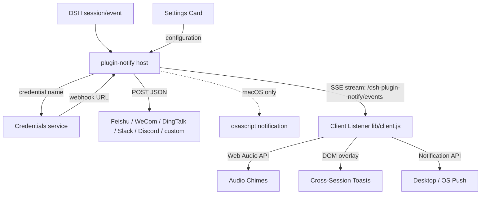

# 📦 @goodandready/dsh-plugin-notify

<div align="center">

<h3>Remote IM webhooks for turn done, errors, and approval waits</h3>

<p align="center">
  <a href="LICENSE"></a>
  <a href="https://github.com/topics/dsh-plugin"></a>
  <a href="https://nodejs.org"></a>
</p>

<p align="center">
  <a href="https://goodandready.app/"></a>
</p>

<p align="center">
  <a href="README.md"><b>🇬🇧 English</b></a> •
  <a href="README.zh.md"><b>🇨🇳 中文说明</b></a> •
  <a href="README.ru.md"><b>🇷🇺 Русский</b></a>
</p>

<table align="center">
  <tr>
    <td align="center">
      ⭐ <strong>If you like this plugin, please star it on GitHub</strong> — it shows me that the plugin is useful to you and motivates me to keep developing it.
      <br><br>
      🐛 <strong>If you find a bug or would like to request a feature</strong>, open a GitHub issue in any language — I will review your proposal and implement useful suggestions in a future plugin version.
    </td>
  </tr>
</table>

</div>

---

## Overview / The Problem

DeepSeek Harness already knows when a turn finished, failed, or is waiting for approval. Without this plugin, those events remain confined inside the session. If you are working across multiple parallel sessions or minimized in another app, you have to keep manually checking back.

This plugin bridges that gap across four flexible notification layers:
1. **Audio Chimes**: Synthesized Web Audio pentatonic chimes that play immediately upon turn completion, failure, or approval requests without external audio files.
2. **Cross-Session Toasts**: On-screen floating banners that alert you across sessions with an interactive **"Go to session"** button to jump directly to the session that fired the event.
3. **Desktop / OS Push Notifications**: Native Windows, macOS, Linux, and DSH Desktop notifications via HTML5 `Notification API` with window focus and session switching on click.
4. **Remote IM Webhooks**: Outbound JSON webhooks for Feishu, WeCom, DingTalk, Slack, Discord, or generic custom endpoints. Webhook URLs are kept secret in DSH Credentials.

## Architecture



## Feature breakdown

### Host (`lib/index.js`)

- Subscribes to `session/event`.
- `turn/end` with `reason.kind === 'completed'` → `task_done`.
- `turn/end` with any other reason → `error`.
- `approval/asked` → `approval_requested`.
- Streams real-time notifications to connected clients via SSE (`GET /dsh-plugin-notify/events`) on the Cordis `webServer` service.
- Resolves each `webhooks.*` value as: legacy `http(s)://` URL (deprecated warning) → Credentials `resolve(credentialRef(name))` → `process.env[name]`.
- Posts with `AbortSignal.timeout(timeoutMs)` (default 5000 ms). Failed POSTs are logged and never retried, and they never block the agent loop.
- Optional DND window (`HH:MM`, including overnight ranges). Events are still observed; webhooks, chimes, and local popups are skipped.
- `excludeSessionPrefixes` skips sessions whose id starts with a configured prefix.

### Client (`lib/client.js`)

- Native settings card on `settings.plugin.item`.
- Web Audio API dual-tone chime synthesizer for `task_done`, `error`, and `approval_requested` with interactive "Test sound" button.
- Non-intrusive floating toast manager with session navigation button and interactive "Test toast" button.
- Native HTML5 desktop push integration with permission request workflow.
- Real-time SSE subscriber with exponential-backoff auto-reconnect and optional `notifyBackgroundOnly` filter.
- Snapshot status `loading` / `unavailable` / `ready` before the form is writable.
- Save writes every field and lists named failures.
- Locale dictionaries: `en` and `zh` only. Russian UI is supplied at runtime by `dsh-russian-lang`.
- Injected stylesheet is tagged `data-dsh-plugin="dsh-plugin-notify"`.

## Install

This package is private (GitHub Packages). After you have registry access:

```sh
dsh plugin --profile web add @goodandready/dsh-plugin-notify
```

Restart the web profile so the client half loads. Then open **Settings → Plugins → Notify**.

## Configuration

Put each webhook URL into **Settings → Credentials**. In the plugin card, type only the credential name.

```yaml
- id: plugin-notify
  name: '@goodandready/dsh-plugin-notify'
  config:
    enableSound: false
    enableToasts: false
    enableDesktopNotifications: false
    notifyBackgroundOnly: false
    webhooks:
      feishu: NOTIFY_FEISHU_WEBHOOK
      wecom: NOTIFY_WECOM_WEBHOOK
      dingtalk: NOTIFY_DINGTALK_WEBHOOK
      slack: NOTIFY_SLACK_WEBHOOK
      discord: NOTIFY_DISCORD_WEBHOOK
      custom: NOTIFY_CUSTOM_WEBHOOK
    events: [task_done, error, approval_requested]
    local: true
    timeoutMs: 5000
    dnd:
      start: ''
      end: ''
    includeSession: true
    includeDuration: true
    excludeSessionPrefixes: []
```

| Parameter | Type | Default | Description |
|---|---|---|---|
| `enableSound` | boolean | `false` | Synthesize gentle Web Audio chimes on turn finish, error, or approval wait (opt-in). |
| `enableToasts` | boolean | `false` | Show cross-session on-screen banner toasts with interactive session switching (opt-in). |
| `enableDesktopNotifications` | boolean | `false` | Show native OS push notifications via HTML5 Notification API (opt-in). |
| `notifyBackgroundOnly` | boolean | `false` | Only trigger audio, toasts, and push when event is from an inactive/background session. |
| `webhooks.*` | string | empty | Credential **name** whose value is the webhook URL. Empty disables the channel. |
| `events` | string[] | `task_done`, `error`, `approval_requested` | Event whitelist. Empty restores the default three. |
| `local` | boolean | `true` | macOS `osascript` popup; ignored on other platforms. |
| `timeoutMs` | number | `5000` | Per-request abort timeout. |
| `dnd.start` / `dnd.end` | string | empty | `HH:MM` window. Equal or invalid values disable DND. |
| `includeSession` | boolean | `true` | Append `Session: …` to the text body. |
| `includeDuration` | boolean | `true` | Append `Duration: …` when a turn start timestamp is known. |
| `excludeSessionPrefixes` | string[] | `[]` | Skip notifications when `session.id` starts with any prefix. |

A leftover raw `http(s)://` value in `webhooks.*` still posts, with a deprecation warning. Migrate it to Credentials.

## Message shape

| Channel | JSON body |
|---|---|
| Feishu | `{ msg_type: 'text', content: { text } }` |
| WeCom | `{ msgtype: 'text', text: { content: text } }` |
| DingTalk | `{ msgtype: 'text', text: { content: text } }` |
| Slack | `{ text }` |
| Discord | `{ content: text }` |
| custom | `{ text, kind, title, sessionId, durationMs, time }` |

Text body:

```
【Task done】short session title
Summary: …
Reason: completed
Duration: 3m 42s
Session: session-1
```

## Tests

From a clone:

```sh
npm install --no-audit --no-fund --no-package-lock
npm test
```

`pretest` runs `node --check` on `lib/index.js` and `lib/client.js`. `npm test` then runs `node --test test/*.test.mjs`.

The suite stubs `fetch` / a local HTTP listener. It does not call a real IM provider. Live delivery needs a webhook you own.

Expected output:

```text
✔ public package identity matches host, client and patch sites
✔ client locale registration coexists with Russian language pack
✔ client apply does not register ru and can reload after effect dispose
✔ legacy raw webhook URL still posts (compat)
✔ credential ref resolves webhook URL via credentials service
✔ resolveWebhookValue prefers credentials then env
✔ missing credential name does not post
✔ each IM channel posts the expected body shape
✔ recipient HTTP failure does not throw out of the session loop
✔ AbortSignal.timeout is attached to webhook POST
✔ excluded session prefixes suppress notifications
✔ Config schema validates sound, toast, and desktop notification fields with opt-in defaults
✔ SSE route registers on webServer, rejects untrusted requests, and handles trusted stream
✔ client does not register settings.section slot (issue #16 fix)
✔ deliveries and warnings are routed through ctx.logger without console calls (issue #22 fix)
ℹ tests 15
ℹ pass 15
ℹ fail 0
```

## License

MIT © [GooDAnDReaDY](https://github.com/GooDAnDReaDY)

## Changelog

See [CHANGELOG.md](CHANGELOG.md) for full release and version history.

