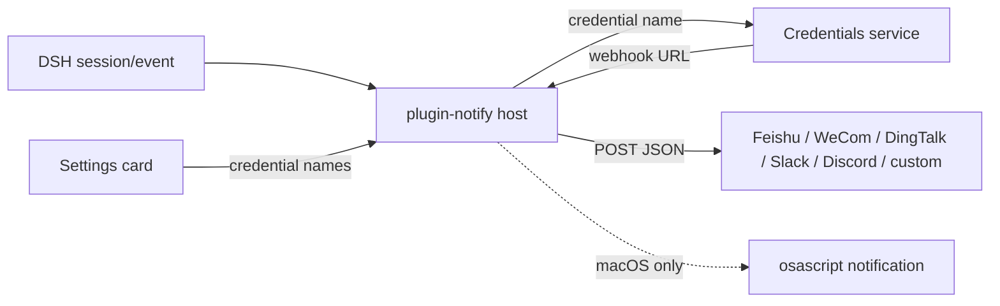

# 📦 @goodandready-private/dsh-plugin-notify

<div align="center">

<h3>Remote IM webhooks for turn done, errors, and approval waits</h3>

<p align="center">
  <a href="LICENSE"></a>
  <a href="https://github.com/topics/dsh-plugin"></a>
  <a href="https://nodejs.org"></a>
</p>

<p align="center">
  <a href="https://goodandready.app/"></a>
</p>

<p align="center">
  <a href="README.md"><b>🇬🇧 English</b></a> •
  <a href="README.zh.md"><b>🇨🇳 中文说明</b></a> •
  <a href="README.ru.md"><b>🇷🇺 Русский</b></a>
</p>

<table align="center">
  <tr>
    <td align="center">
      ⭐ <strong>If you like this plugin, please star it on GitHub</strong> — it shows me that the plugin is useful to you and motivates me to keep developing it.
      <br><br>
      🐛 <strong>If you find a bug or would like to request a feature</strong>, open a GitHub issue in any language — I will review your proposal and implement useful suggestions in a future plugin version.
    </td>
  </tr>
</table>

</div>

---

## Overview / The Problem

DeepSeek Harness already knows when a turn finished, failed, or is waiting for approval. Without this plugin those events stay inside the session. Local-only notifiers cannot reach a phone or a team chat.

This plugin listens to the durable `session/event` firehose on the host half and POSTs a short text payload to the IM channels you enable. Webhook URLs are secrets: they live in DSH Credentials. The settings card stores only credential **names**.

## Architecture



## Feature breakdown

### Host (`lib/index.js`)

- Subscribes to `session/event`.
- `turn/end` with `reason.kind === 'completed'` → `task_done`.
- `turn/end` with any other reason → `error`.
- `approval/asked` → `approval_requested`.
- Resolves each `webhooks.*` value as: legacy `http(s)://` URL (deprecated warning) → Credentials `resolve(credentialRef(name))` → `process.env[name]`.
- Posts with `AbortSignal.timeout(timeoutMs)` (default 5000 ms). Failed POSTs are logged and never retried, and they never block the agent loop.
- Optional DND window (`HH:MM`, including overnight ranges). Events are still observed; webhooks and local popups are skipped.
- `excludeSessionPrefixes` skips sessions whose id starts with a configured prefix.

### Client (`lib/client.js`)

- Native settings card on `settings.plugin.item` (fallback `settings.section`).
- Snapshot status `loading` / `unavailable` / `ready` before the form is writable.
- Save writes every field and lists named failures.
- Locale dictionaries: `en` and `zh` only. Russian UI is supplied at runtime by `dsh-russian-lang`.
- Injected stylesheet is tagged `data-dsh-plugin="dsh-plugin-notify"`.

## Install

This package is private (GitHub Packages). After you have registry access:

```sh
dsh plugin --profile web add @goodandready-private/dsh-plugin-notify
```

Restart the web profile so the client half loads. Then open **Settings → Plugins → Notify**.

## Configuration

Put each webhook URL into **Settings → Credentials**. In the plugin card, type only the credential name.

```yaml
- id: plugin-notify
  name: '@goodandready-private/dsh-plugin-notify'
  config:
    webhooks:
      feishu: NOTIFY_FEISHU_WEBHOOK
      wecom: NOTIFY_WECOM_WEBHOOK
      dingtalk: NOTIFY_DINGTALK_WEBHOOK
      slack: NOTIFY_SLACK_WEBHOOK
      discord: NOTIFY_DISCORD_WEBHOOK
      custom: NOTIFY_CUSTOM_WEBHOOK
    events: [task_done, error, approval_requested]
    local: true
    timeoutMs: 5000
    dnd:
      start: ''
      end: ''
    includeSession: true
    includeDuration: true
    excludeSessionPrefixes: []
```

| Parameter | Type | Default | Description |
|---|---|---|---|
| `webhooks.*` | string | empty | Credential **name** whose value is the webhook URL. Empty disables the channel. |
| `events` | string[] | `task_done`, `error`, `approval_requested` | Event whitelist. Empty restores the default three. |
| `local` | boolean | `true` | macOS `osascript` popup; ignored on other platforms. |
| `timeoutMs` | number | `5000` | Per-request abort timeout. |
| `dnd.start` / `dnd.end` | string | empty | `HH:MM` window. Equal or invalid values disable DND. |
| `includeSession` | boolean | `true` | Append `Session: …` to the text body. |
| `includeDuration` | boolean | `true` | Append `Duration: …` when a turn start timestamp is known. |
| `excludeSessionPrefixes` | string[] | `[]` | Skip notifications when `session.id` starts with any prefix. |

A leftover raw `http(s)://` value in `webhooks.*` still posts, with a deprecation warning. Migrate it to Credentials.

## Message shape

| Channel | JSON body |
|---|---|
| Feishu | `{ msg_type: 'text', content: { text } }` |
| WeCom | `{ msgtype: 'text', text: { content: text } }` |
| DingTalk | `{ msgtype: 'text', text: { content: text } }` |
| Slack | `{ text }` |
| Discord | `{ content: text }` |
| custom | `{ text, kind, title, sessionId, durationMs, time }` |

Text body:

```
【Task done】short session title
Summary: …
Reason: completed
Duration: 3m 42s
Session: session-1
```

## Tests

From a clone:

```sh
npm install --no-audit --no-fund --no-package-lock
npm test
```

`pretest` runs `node --check` on `lib/index.js` and `lib/client.js`. `npm test` then runs `node --test test/*.test.mjs`.

The suite stubs `fetch` / a local HTTP listener. It does not call a real IM provider. Live delivery needs a webhook you own.

## License

MIT © [GooDAnDReaDY](https://github.com/GooDAnDReaDY)
