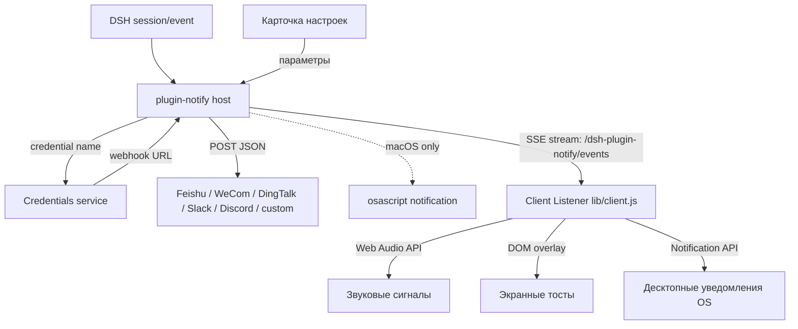

# 📦 @goodandready/dsh-plugin-notify

<div align="center">

<h3>Удалённые IM-webhook уведомления о завершении хода, ошибке и ожидании approval</h3>

<p align="center">
  <a href="https://www.npmjs.com/package/@goodandready/dsh-plugin-notify"></a>
  <a href="LICENSE"></a>
  <a href="https://github.com/topics/dsh-plugin"></a>
  <a href="https://nodejs.org"></a>
</p>

<p align="center">
  <a href="https://goodandready.app/"></a>
</p>

<p align="center">
  <a href="README.md"><b>🇬🇧 English</b></a> •
  <a href="README.zh.md"><b>🇨🇳 中文说明</b></a> •
  <a href="README.ru.md"><b>🇷🇺 Русский</b></a>
</p>

<table align="center">
  <tr>
    <td align="center">
      ⭐ <strong>Если вам нравится этот плагин, поставьте ему Star на GitHub</strong> — это покажет мне, что плагин полезен, и добавит мотивации продолжать его развитие.
      <br><br>
      🐛 <strong>Если вы нашли баг или хотите предложить новую функцию</strong>, создайте Issue на GitHub на любом языке — я рассмотрю предложение и реализую полезные улучшения в одной из следующих версий плагина.
    </td>
  </tr>
</table>

</div>

---

## Обзор / Проблема

DeepSeek Harness уже знает, когда ход завершился, упал или ждёт approval. Без этого плагина события остаются внутри сессии. Если вы ведёте несколько параллельных сессий или переключились в другое приложение, приходится постоянно заглядывать и проверять статус вручную.

Плагин закрывает этот разрыв четырьмя уровнями уведомлений:
1. **Звуковые сигналы (Web Audio)**: Приятные пентатонические переливы колокольчиков прямо в браузере или приложении DSH без внешних аудиофайлов.
2. **Экранные тосты (In-App Toasts)**: Всплывающие карточки поверх сессий с интерактивной кнопкой **«Перейти в сессию»** для мгновенного перехода к нужной задаче.
3. **Системные уведомления (OS / Desktop Push)**: Нативные уведомления Windows, macOS, Linux и DSH Desktop через HTML5 `Notification API` с фокусировкой окна и переходом в сессию.
4. **Удалённые вебхуки (Remote IM)**: Отправка JSON-событий в Feishu, WeCom, DingTalk, Slack, Discord или custom HTTP-эндпоинт. Секретные URL вебхуков надёжно хранятся в DSH Credentials.

Русский интерфейс карточки настроек даёт отдельный языковой пакет `dsh-russian-lang`. Этот плагин регистрирует словари `en` и `zh`.

## Архитектура



## Возможности

### Хост (`lib/index.js`)

- Подписка на `session/event`.
- `turn/end` с `reason.kind === 'completed'` → `task_done`.
- любой другой `turn/end` → `error`.
- `approval/asked` → `approval_requested`.
- Трансляция событий в реальном времени через SSE (`GET /dsh-plugin-notify/events`) через сервис Cordis `webServer`.
- Разрешение `webhooks.*`: устаревший сырой `http(s)://` (предупреждение) → Credentials `resolve` → `process.env[name]`.
- POST с `AbortSignal.timeout(timeoutMs)` (по умолчанию 5000 мс). Ошибка POST только логируется, без ретрая и без блокировки цикла агента.
- Опциональное окно DND (`HH:MM`, в том числе через полночь). События наблюдаются; вебхуки, звуки и локальные попапы пропускаются.
- `excludeSessionPrefixes` пропускает сессии, чей id начинается с заданного префикса.

### Клиент (`lib/client.js`)

- Нативная карточка настроек на `settings.plugin.item`.
- Синтезатор звуковых сигналов Web Audio API для `task_done`, `error` и `approval_requested` с кнопкой «Проверить звук».
- Ненавязчивый менеджер тостов с кнопкой перехода в сессию и кнопкой «Проверить тост».
- Поддержка нативных десктопных пушей HTML5 с запросом разрешений.
- Подписчик SSE с авто-реконнектом и опциональным фильтром `notifyBackgroundOnly`.
- Статусы снимка `loading` / `unavailable` / `ready`.
- Save записывает все поля и перечисляет ошибки по имени.
- Стили помечаются `data-dsh-plugin="dsh-plugin-notify"`.

## Установка

Пакет приватный (GitHub Packages). После доступа к registry:

```sh
dsh plugin --profile web add @goodandready/dsh-plugin-notify
```

Перезапустите web-профиль, чтобы загрузилась клиентская половина. Затем **Настройки → Плагины → Notify**.

## Конфигурация

Положите каждый webhook URL в **Настройки → Credentials**. В карточке плагина указывайте только имя учётной записи.

```yaml
- id: plugin-notify
  name: '@goodandready/dsh-plugin-notify'
  config:
    enableSound: false
    enableToasts: false
    enableDesktopNotifications: false
    notifyBackgroundOnly: false
    webhooks:
      feishu: NOTIFY_FEISHU_WEBHOOK
      wecom: NOTIFY_WECOM_WEBHOOK
      dingtalk: NOTIFY_DINGTALK_WEBHOOK
      slack: NOTIFY_SLACK_WEBHOOK
      discord: NOTIFY_DISCORD_WEBHOOK
      custom: NOTIFY_CUSTOM_WEBHOOK
    events: [task_done, error, approval_requested]
    local: true
    timeoutMs: 5000
    dnd:
      start: ''
      end: ''
    includeSession: true
    includeDuration: true
    excludeSessionPrefixes: []
```

| Параметр | Тип | По умолчанию | Описание |
|---|---|---|---|
| `enableSound` | boolean | `false` | Звуковые сигналы Web Audio при завершении задачи, ошибке или запросе approval (выключено по умолчанию, opt-in). |
| `enableToasts` | boolean | `false` | Экранные всплывающие тосты поверх всех сессий с кнопкой перехода (opt-in). |
| `enableDesktopNotifications` | boolean | `false` | Системные десктопные уведомления ОС через Notification API (opt-in). |
| `notifyBackgroundOnly` | boolean | `false` | Уведомлять только если событие произошло в неактивной фоновой сессии. |
| `webhooks.*` | string | пусто | **Имя** credential, значение которого — URL вебхука. Пусто отключает канал. |
| `events` | string[] | `task_done`, `error`, `approval_requested` | Белый список событий. Пусто возвращает три значения по умолчанию. |
| `local` | boolean | `true` | macOS `osascript`; на других ОС игнорируется. |
| `timeoutMs` | number | `5000` | Таймаут одного запроса. |
| `dnd.start` / `dnd.end` | string | пусто | Окно `HH:MM`. Равные или невалидные значения отключают DND. |
| `includeSession` | boolean | `true` | Добавить строку `Session: …`. |
| `includeDuration` | boolean | `true` | Добавить `Duration: …`, если известно время старта хода. |
| `excludeSessionPrefixes` | string[] | `[]` | Не слать уведомления, если `session.id` начинается с префикса. |

Сырой `http(s)://` в `webhooks.*` всё ещё отправляется с предупреждением. Перенесите URL в Credentials.

## Формат сообщения

| Канал | JSON |
|---|---|
| Feishu | `{ msg_type: 'text', content: { text } }` |
| WeCom | `{ msgtype: 'text', text: { content: text } }` |
| DingTalk | `{ msgtype: 'text', text: { content: text } }` |
| Slack | `{ text }` |
| Discord | `{ content: text }` |
| custom | `{ text, kind, title, sessionId, durationMs, time }` |

## Тесты

```sh
npm install --no-audit --no-fund --no-package-lock
npm test
```

`pretest` делает `node --check` для `lib/index.js` и `lib/client.js`. Затем `node --test test/*.test.mjs`.

Набор подменяет `fetch` или поднимает локальный HTTP-приёмник и не ходит в реальный IM. Живая доставка требует вашего вебхука.

Ожидаемый вывод:

```text
✔ public package identity matches host, client and patch sites
✔ client locale registration coexists with Russian language pack
✔ client apply does not register ru and can reload after effect dispose
✔ legacy raw webhook URL still posts (compat)
✔ credential ref resolves webhook URL via credentials service
✔ resolveWebhookValue prefers credentials then env
✔ missing credential name does not post
✔ each IM channel posts the expected body shape
✔ recipient HTTP failure does not throw out of the session loop
✔ AbortSignal.timeout is attached to webhook POST
✔ excluded session prefixes suppress notifications
✔ Config schema validates sound, toast, and desktop notification fields with opt-in defaults
✔ SSE route registers on webServer, rejects untrusted requests, and handles trusted stream
✔ client does not register settings.section slot (issue #16 fix)
✔ deliveries and warnings are routed through ctx.logger without console calls (issue #22 fix)
ℹ tests 15
ℹ pass 15
ℹ fail 0
```

## Лицензия

MIT © [GooDAnDReaDY](https://github.com/GooDAnDReaDY)

## История изменений

Подробный список изменений доступен в [CHANGELOG.md](CHANGELOG.md).

