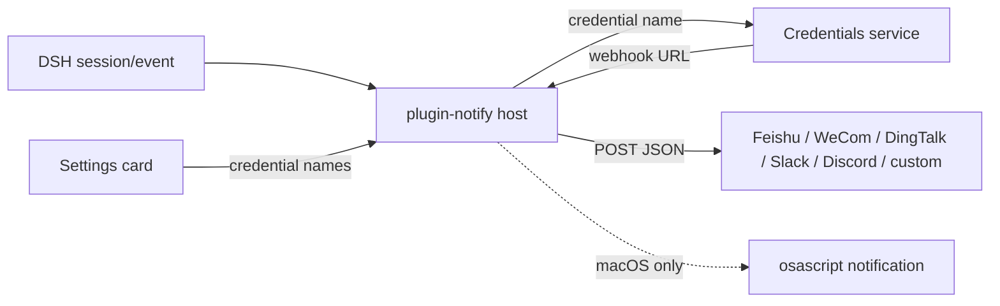

# 📦 @goodandready-private/dsh-plugin-notify

<div align="center">

<h3>Удалённые IM-webhook уведомления о завершении хода, ошибке и ожидании approval</h3>

<p align="center">
  <a href="LICENSE"></a>
  <a href="https://github.com/topics/dsh-plugin"></a>
  <a href="https://nodejs.org"></a>
</p>

<p align="center">
  <a href="https://goodandready.app/"></a>
</p>

<p align="center">
  <a href="README.md"><b>🇬🇧 English</b></a> •
  <a href="README.zh.md"><b>🇨🇳 中文说明</b></a> •
  <a href="README.ru.md"><b>🇷🇺 Русский</b></a>
</p>

<table align="center">
  <tr>
    <td align="center">
      ⭐ <strong>Если вам нравится этот плагин, поставьте ему Star на GitHub</strong> — это покажет мне, что плагин полезен, и добавит мотивации продолжать его развитие.
      <br><br>
      🐛 <strong>Если вы нашли баг или хотите предложить новую функцию</strong>, создайте Issue на GitHub на любом языке — я рассмотрю предложение и реализую полезные улучшения в одной из следующих версий плагина.
    </td>
  </tr>
</table>

</div>

---

## Обзор / Проблема

DeepSeek Harness уже знает, когда ход завершился, упал или ждёт approval. Без этого плагина события остаются внутри сессии. Только локальное всплывающее окно не дойдёт до телефона или командного чата.

Плагин слушает устойчивый поток `session/event` на стороне хоста и делает POST короткого текста в включённые IM-каналы. URL вебхуков — секреты: они хранятся в DSH Credentials. Карточка настроек хранит только **имена** учётных данных.

Русский интерфейс карточки даёт отдельный `dsh-russian-lang`. Этот плагин регистрирует только словари `en` и `zh`.

## Архитектура



## Возможности

### Хост (`lib/index.js`)

- Подписка на `session/event`.
- `turn/end` с `reason.kind === 'completed'` → `task_done`.
- любой другой `turn/end` → `error`.
- `approval/asked` → `approval_requested`.
- Разрешение `webhooks.*`: устаревший сырой `http(s)://` (предупреждение) → Credentials `resolve` → `process.env[name]`.
- POST с `AbortSignal.timeout(timeoutMs)` (по умолчанию 5000 мс). Ошибка POST только логируется, без ретрая и без блокировки цикла агента.
- Опциональное окно DND (`HH:MM`, в том числе через полночь). События наблюдаются; вебхуки и локальные попапы пропускаются.
- `excludeSessionPrefixes` пропускает сессии, чей id начинается с заданного префикса.

### Клиент (`lib/client.js`)

- Нативная карточка `settings.plugin.item` (запасной путь `settings.section`).
- Статусы снимка `loading` / `unavailable` / `ready`.
- Save записывает все поля и перечисляет ошибки по имени.
- Стили помечаются `data-dsh-plugin="dsh-plugin-notify"`.

## Установка

Пакет приватный (GitHub Packages). После доступа к registry:

```sh
dsh plugin --profile web add @goodandready-private/dsh-plugin-notify
```

Перезапустите web-профиль, чтобы загрузилась клиентская половина. Затем **Настройки → Плагины → Notify**.

## Конфигурация

Положите каждый webhook URL в **Настройки → Credentials**. В карточке плагина указывайте только имя учётной записи.

```yaml
- id: plugin-notify
  name: '@goodandready-private/dsh-plugin-notify'
  config:
    webhooks:
      feishu: NOTIFY_FEISHU_WEBHOOK
      wecom: NOTIFY_WECOM_WEBHOOK
      dingtalk: NOTIFY_DINGTALK_WEBHOOK
      slack: NOTIFY_SLACK_WEBHOOK
      discord: NOTIFY_DISCORD_WEBHOOK
      custom: NOTIFY_CUSTOM_WEBHOOK
    events: [task_done, error, approval_requested]
    local: true
    timeoutMs: 5000
    dnd:
      start: ''
      end: ''
    includeSession: true
    includeDuration: true
    excludeSessionPrefixes: []
```

| Параметр | Тип | По умолчанию | Описание |
|---|---|---|---|
| `webhooks.*` | string | пусто | **Имя** credential, значение которого — URL вебхука. Пусто отключает канал. |
| `events` | string[] | `task_done`, `error`, `approval_requested` | Белый список событий. Пусто возвращает три значения по умолчанию. |
| `local` | boolean | `true` | macOS `osascript`; на других ОС игнорируется. |
| `timeoutMs` | number | `5000` | Таймаут одного запроса. |
| `dnd.start` / `dnd.end` | string | пусто | Окно `HH:MM`. Равные или невалидные значения отключают DND. |
| `includeSession` | boolean | `true` | Добавить строку `Session: …`. |
| `includeDuration` | boolean | `true` | Добавить `Duration: …`, если известно время старта хода. |
| `excludeSessionPrefixes` | string[] | `[]` | Не слать уведомления, если `session.id` начинается с префикса. |

Сырой `http(s)://` в `webhooks.*` всё ещё отправляется с предупреждением. Перенесите URL в Credentials.

## Формат сообщения

| Канал | JSON |
|---|---|
| Feishu | `{ msg_type: 'text', content: { text } }` |
| WeCom | `{ msgtype: 'text', text: { content: text } }` |
| DingTalk | `{ msgtype: 'text', text: { content: text } }` |
| Slack | `{ text }` |
| Discord | `{ content: text }` |
| custom | `{ text, kind, title, sessionId, durationMs, time }` |

## Тесты

```sh
npm install --no-audit --no-fund --no-package-lock
npm test
```

`pretest` делает `node --check` для `lib/index.js` и `lib/client.js`. Затем `node --test test/*.test.mjs`.

Набор подменяет `fetch` или поднимает локальный HTTP-приёмник и не ходит в реальный IM. Живая доставка требует вашего вебхука.

## Лицензия

MIT © [GooDAnDReaDY](https://github.com/GooDAnDReaDY)

## Changed in v0.2.5

- Исходники runtime лежат в `lib/`, а не в вводящем в заблуждение `dist/`; TypeScript-сборки нет.
- Стили карточки помечены `data-dsh-plugin="dsh-plugin-notify"`, чтобы HMR и очистка соседнего плагина не снимали оформление.
- Тесты покрывают тела IM-каналов, отсутствие credential, отказ получателя, AbortSignal и перезагрузку locale без словаря `ru`.
- README есть на английском, китайском и русском. `AGENTS.md` / `index.md` остаются в Gitea и не входят в npm-пакет.

