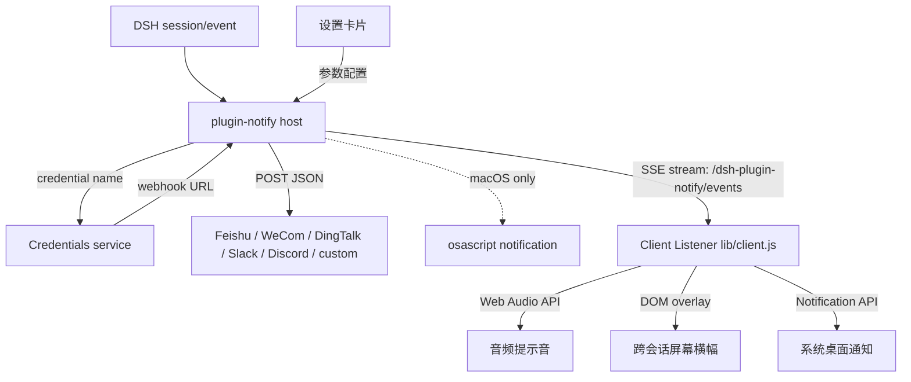

# 📦 @goodandready-private/dsh-plugin-notify

<div align="center">

<h3>回合完成、出错、等待审批时发送远程 IM Webhook 通知</h3>

<p align="center">
  <a href="LICENSE"></a>
  <a href="https://github.com/topics/dsh-plugin"></a>
  <a href="https://nodejs.org"></a>
</p>

<p align="center">
  <a href="https://goodandready.app/"></a>
</p>

<p align="center">
  <a href="README.md"><b>🇬🇧 English</b></a> •
  <a href="README.zh.md"><b>🇨🇳 中文说明</b></a> •
  <a href="README.ru.md"><b>🇷🇺 Русский</b></a>
</p>

<table align="center">
  <tr>
    <td align="center">
      ⭐ <strong>如果您喜欢这个插件，请在 GitHub 上为它点亮 Star</strong> — 这能让我知道插件对您有用，并鼓励我继续开发和维护它。
      <br><br>
      🐛 <strong>如果您发现 Bug 或希望增加功能</strong>，请使用任意语言在 GitHub 上提交 Issue — 我会评估您的建议，并在后续版本中实现有价值的改进。
    </td>
  </tr>
</table>

</div>

---

### 概述 / 问题

DeepSeek Harness 已经知道回合何时完成、失败或等待审批。没有本插件时，这些事件只留在会话里。如果你同时打开多个并行会话或切换到了其他应用，不得不频繁切回窗口手动查看状态。

本插件通过四个层级全面覆盖通知场景：
1. **音频提示音 (Web Audio)**：使用浏览器内置 Web Audio API 合成双音五声音阶提示音，在任务完成、出错或等待审批时轻柔提示，无需外部音频文件。
2. **跨会话屏幕横幅 (In-App Toasts)**：在界面上方显示浮动通知卡片，带有交互式**“跳转至会话”**按钮，可一键切换到触发事件的目标会话。
3. **桌面 / 系统级通知 (OS Push)**：通过 HTML5 `Notification API` 触发 Windows、macOS、Linux 及 DSH 桌面端系统原生通知，点击自动聚焦窗口并跳转会话。
4. **远程 IM Webhook**：向飞书、企业微信、钉钉、Slack、Discord 或自定义 HTTP 接口投递 JSON 负载。Webhook URL 作为机密安全保存在 DSH 凭据中。

## 架构



## 功能说明

### 宿主（`lib/index.js`）

- 订阅 `session/event`。
- `turn/end` 且 `reason.kind === 'completed'` → `task_done`。
- 其他 `turn/end` 原因 → `error`。
- `approval/asked` → `approval_requested`。
- 通过 Cordis `webServer` 服务向已连接的前端客户端提供实时 SSE 事件流（`GET /dsh-plugin-notify/events`）。
- 解析 `webhooks.*`：遗留 `http(s)://` URL（弃用警告）→ Credentials `resolve` → `process.env[name]`。
- 使用 `AbortSignal.timeout(timeoutMs)`（默认 5000 ms）。POST 失败只记录，不重试，不阻塞 agent 循环。
- 可选免打扰窗口（`HH:MM`，支持跨夜）。事件仍会观察；Webhook、提示音和本机弹窗会跳过。
- `excludeSessionPrefixes` 会跳过 id 匹配前缀的会话。

### 客户端（`lib/client.js`）

- 原生设置卡片：`settings.plugin.item`。
- Web Audio API 双音提示音合成器，支持 `task_done`、`error` 与 `approval_requested`，附带“测试声音”按钮。
- 跨会话浮动 Toast 管理器，支持跳转会话及“测试通知”按钮。
- HTML5 原生桌面通知集成与权限申请。
- 实时 SSE 订阅器，支持指数退避自动重连及可选的 `notifyBackgroundOnly` 过滤。
- 快照状态 `loading` / `unavailable` / `ready`。
- 保存会写入全部字段并列出失败项。
- 语言包只有 `en` 和 `zh`。俄语界面由 `dsh-russian-lang` 在运行时提供。
- 样式标签带 `data-dsh-plugin="dsh-plugin-notify"`。

## 安装

本包为私有包（GitHub Packages）。在具备仓库访问权限后：

```sh
dsh plugin --profile web add @goodandready-private/dsh-plugin-notify
```

重启 web 配置以便加载客户端。然后打开 **设置 → 插件 → Notify**。

## 配置

把每个 Webhook URL 放到 **设置 → 凭据**。在插件卡片里只填写凭据名称。

```yaml
- id: plugin-notify
  name: '@goodandready-private/dsh-plugin-notify'
  config:
    enableSound: false
    enableToasts: false
    enableDesktopNotifications: false
    notifyBackgroundOnly: false
    webhooks:
      feishu: NOTIFY_FEISHU_WEBHOOK
      wecom: NOTIFY_WECOM_WEBHOOK
      dingtalk: NOTIFY_DINGTALK_WEBHOOK
      slack: NOTIFY_SLACK_WEBHOOK
      discord: NOTIFY_DISCORD_WEBHOOK
      custom: NOTIFY_CUSTOM_WEBHOOK
    events: [task_done, error, approval_requested]
    local: true
    timeoutMs: 5000
    dnd:
      start: ''
      end: ''
    includeSession: true
    includeDuration: true
    excludeSessionPrefixes: []
```

| 参数 | 类型 | 默认值 | 说明 |
|---|---|---|---|
| `enableSound` | boolean | `false` | 回合完成、出错或等待审批时播放 Web Audio 合成提示音（默认关闭，需显式开启）。 |
| `enableToasts` | boolean | `false` | 跨会话弹出屏幕横幅通知，附带一键跳转按钮（默认关闭，需显式开启）。 |
| `enableDesktopNotifications` | boolean | `false` | 系统原生桌面推送（Windows、macOS、Linux、DSH 桌面版，需显式开启并授权）。 |
| `notifyBackgroundOnly` | boolean | `false` | 仅当事件发生在非活跃/后台会话时才触发通知。 |
| `webhooks.*` | string | 空 | 值为 Webhook URL 的凭据**名称**。空则关闭该通道。 |
| `events` | string[] | `task_done`, `error`, `approval_requested` | 事件白名单。空则恢复默认三项。 |
| `local` | boolean | `true` | macOS `osascript` 弹窗；其他平台忽略。 |
| `timeoutMs` | number | `5000` | 单次请求中止超时。 |
| `dnd.start` / `dnd.end` | string | 空 | `HH:MM` 窗口。相等或非法则关闭免打扰。 |
| `includeSession` | boolean | `true` | 在正文追加 `Session: …`。 |
| `includeDuration` | boolean | `true` | 在已知回合开始时间时追加 `Duration: …`。 |
| `excludeSessionPrefixes` | string[] | `[]` | 当 `session.id` 以任一前缀开头时跳过通知。 |

`webhooks.*` 中残留的原始 `http(s)://` 仍会发送，但会给出弃用警告。请迁移到凭据。

## 消息格式

| 通道 | JSON 正文 |
|---|---|
| 飞书 | `{ msg_type: 'text', content: { text } }` |
| 企业微信 | `{ msgtype: 'text', text: { content: text } }` |
| 钉钉 | `{ msgtype: 'text', text: { content: text } }` |
| Slack | `{ text }` |
| Discord | `{ content: text }` |
| custom | `{ text, kind, title, sessionId, durationMs, time }` |

## 测试

```sh
npm install --no-audit --no-fund --no-package-lock
npm test
```

`pretest` 会对 `lib/index.js` 和 `lib/client.js` 执行 `node --check`。随后 `node --test test/*.test.mjs`。

套件使用 stub `fetch` 或本地 HTTP 监听器，不会调用真实 IM 服务。真实投递需要你自己的 Webhook。

预期输出：

```text
✔ private package identity matches host, client and patch sites
✔ client locale registration coexists with Russian language pack
✔ client apply does not register ru and can reload after effect dispose
✔ legacy raw webhook URL still posts (compat)
✔ credential ref resolves webhook URL via credentials service
✔ resolveWebhookValue prefers credentials then env
✔ missing credential name does not post
✔ each IM channel posts the expected body shape
✔ recipient HTTP failure does not throw out of the session loop
✔ AbortSignal.timeout is attached to webhook POST
✔ excluded session prefixes suppress notifications
✔ Config schema validates sound, toast, and desktop notification fields with opt-in defaults
✔ SSE route registers on webServer, rejects untrusted requests, and handles trusted stream
✔ client does not register settings.section slot (issue #16 fix)
✔ deliveries and warnings are routed through ctx.logger without console calls (issue #22 fix)
ℹ tests 15
ℹ pass 15
ℹ fail 0
```

## 许可证

MIT © [GooDAnDReaDY](https://github.com/GooDAnDReaDY)

## 变更历史

完整更新日志详见 [CHANGELOG.md](CHANGELOG.md)。

