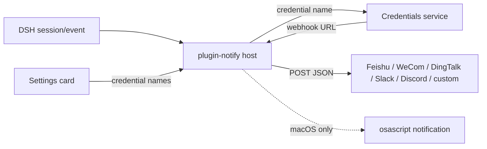

# 📦 @goodandready-private/dsh-plugin-notify

<div align="center">

<h3>回合完成、出错、等待审批时发送远程 IM Webhook 通知</h3>

<p align="center">
  <a href="LICENSE"></a>
  <a href="https://github.com/topics/dsh-plugin"></a>
  <a href="https://nodejs.org"></a>
</p>

<p align="center">
  <a href="https://goodandready.app/"></a>
</p>

<p align="center">
  <a href="README.md"><b>🇬🇧 English</b></a> •
  <a href="README.zh.md"><b>🇨🇳 中文说明</b></a> •
  <a href="README.ru.md"><b>🇷🇺 Русский</b></a>
</p>

<table align="center">
  <tr>
    <td align="center">
      ⭐ <strong>如果您喜欢这个插件，请在 GitHub 上为它点亮 Star</strong> — 这能让我知道插件对您有用，并鼓励我继续开发和维护它。
      <br><br>
      🐛 <strong>如果您发现 Bug 或希望增加功能</strong>，请使用任意语言在 GitHub 上提交 Issue — 我会评估您的建议，并在后续版本中实现有价值的改进。
    </td>
  </tr>
</table>

</div>

---

## 概述 / 问题

DeepSeek Harness 已经知道回合何时完成、失败或等待审批。没有本插件时，这些事件只留在会话里。仅本机弹窗无法到达手机或团队聊天。

本插件在宿主侧监听持久的 `session/event` 流，并向你启用的 IM 通道 POST 一段短文本。Webhook URL 是密钥：它们存放在 DSH 凭据中。设置卡片只保存凭据**名称**。

## 架构



## 功能说明

### 宿主（`lib/index.js`）

- 订阅 `session/event`。
- `turn/end` 且 `reason.kind === 'completed'` → `task_done`。
- 其他 `turn/end` 原因 → `error`。
- `approval/asked` → `approval_requested`。
- 解析 `webhooks.*`：遗留 `http(s)://` URL（弃用警告）→ Credentials `resolve` → `process.env[name]`。
- 使用 `AbortSignal.timeout(timeoutMs)`（默认 5000 ms）。POST 失败只记录，不重试，不阻塞 agent 循环。
- 可选免打扰窗口（`HH:MM`，支持跨夜）。事件仍会观察；Webhook 和本机弹窗会跳过。
- `excludeSessionPrefixes` 会跳过 id 匹配前缀的会话。

### 客户端（`lib/client.js`）

- 原生设置卡片：`settings.plugin.item`（回退 `settings.section`）。
- 快照状态 `loading` / `unavailable` / `ready`。
- 保存会写入全部字段并列出失败项。
- 语言包只有 `en` 和 `zh`。俄语界面由 `dsh-russian-lang` 在运行时提供。
- 样式标签带 `data-dsh-plugin="dsh-plugin-notify"`。

## 安装

本包为私有包（GitHub Packages）。在具备仓库访问权限后：

```sh
dsh plugin --profile web add @goodandready-private/dsh-plugin-notify
```

重启 web 配置以便加载客户端。然后打开 **设置 → 插件 → Notify**。

## 配置

把每个 Webhook URL 放到 **设置 → 凭据**。在插件卡片里只填写凭据名称。

```yaml
- id: plugin-notify
  name: '@goodandready-private/dsh-plugin-notify'
  config:
    webhooks:
      feishu: NOTIFY_FEISHU_WEBHOOK
      wecom: NOTIFY_WECOM_WEBHOOK
      dingtalk: NOTIFY_DINGTALK_WEBHOOK
      slack: NOTIFY_SLACK_WEBHOOK
      discord: NOTIFY_DISCORD_WEBHOOK
      custom: NOTIFY_CUSTOM_WEBHOOK
    events: [task_done, error, approval_requested]
    local: true
    timeoutMs: 5000
    dnd:
      start: ''
      end: ''
    includeSession: true
    includeDuration: true
    excludeSessionPrefixes: []
```

| 参数 | 类型 | 默认值 | 说明 |
|---|---|---|---|
| `webhooks.*` | string | 空 | 值为 Webhook URL 的凭据**名称**。空则关闭该通道。 |
| `events` | string[] | `task_done`, `error`, `approval_requested` | 事件白名单。空则恢复默认三项。 |
| `local` | boolean | `true` | macOS `osascript` 弹窗；其他平台忽略。 |
| `timeoutMs` | number | `5000` | 单次请求中止超时。 |
| `dnd.start` / `dnd.end` | string | 空 | `HH:MM` 窗口。相等或非法则关闭免打扰。 |
| `includeSession` | boolean | `true` | 在正文追加 `Session: …`。 |
| `includeDuration` | boolean | `true` | 在已知回合开始时间时追加 `Duration: …`。 |
| `excludeSessionPrefixes` | string[] | `[]` | 当 `session.id` 以任一前缀开头时跳过通知。 |

`webhooks.*` 中残留的原始 `http(s)://` 仍会发送，但会给出弃用警告。请迁移到凭据。

## 消息格式

| 通道 | JSON 正文 |
|---|---|
| 飞书 | `{ msg_type: 'text', content: { text } }` |
| 企业微信 | `{ msgtype: 'text', text: { content: text } }` |
| 钉钉 | `{ msgtype: 'text', text: { content: text } }` |
| Slack | `{ text }` |
| Discord | `{ content: text }` |
| custom | `{ text, kind, title, sessionId, durationMs, time }` |

## 测试

```sh
npm install --no-audit --no-fund --no-package-lock
npm test
```

`pretest` 会对 `lib/index.js` 和 `lib/client.js` 执行 `node --check`。随后 `node --test test/*.test.mjs`。

套件使用 stub `fetch` 或本地 HTTP 监听器，不会调用真实 IM 服务。真实投递需要你自己的 Webhook。

## 许可证

MIT © [GooDAnDReaDY](https://github.com/GooDAnDReaDY)

## Changed in v0.2.5

- 运行时代码位于 `lib/`，不再使用易误解的 `dist/`；没有 TypeScript 构建。
- 设置卡片样式带有 `data-dsh-plugin="dsh-plugin-notify"`，避免 HMR 或相邻插件清理时丢掉样式。
- 自动化测试覆盖各 IM 通道正文、缺失凭据、接收方失败、AbortSignal，以及不注册 `ru` 的 locale 重载。
- README 提供英文、中文、俄文。`AGENTS.md` / `index.md` 留在 Gitea，不进入 npm 包。

